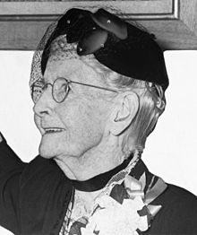

# 老奶奶77岁才开始作画，却闻名全球-《人生永远没有太晚的开始》推荐

## 人物简介
**摩西奶奶**（Grandma Moses，1860年9月7日---1961年12月13日）是一位美国女画家，本名安娜·玛丽·罗伯森·摩西（Anna Mary Robertson Moses）。摩西奶奶常被当作自学成才、大器晚成的代表。她出生贫穷的农家，几乎没有受过教育。她七十多岁时才因关节炎放弃刺绣开始绘画。作品主要描绘的是农场景色以及她的生活。常作全景风景画如收获和制糖场面。共作画一千多幅。

>
>“做你喜欢的事，

>上帝会很高兴地为你打开成功之门，

>哪怕你现在已经80岁了。”

>——摩西奶奶

## 走近摩西奶奶

我是在偶然的情况下了解到摩西奶奶，自己对 code 有点兴趣，但感觉这个行业吃得都是青春饭，一直在想要不要去做。于是我了解到了很多牛人，其中有 阮一峰，经济学博士放弃高校教师转行 IT；余凡-- SegmentFault 牛人，30岁才开始转行前端开发现成为架构师，以及最让我震撼的摩西奶奶！她77岁才开始作画，在美国可能是妇孺皆知的一个老太太，一个从来没有进过美术学校的农村女子，七十多岁的时候才因关节炎，已经拿不了针线，才拿起画笔，这个长寿的老太太活了101岁，留下了1000多幅油画作品，其中二十多幅是在过完100岁生日之后的画作。

登上过《时代》、《生活》杂志的封面，作品在MoMA展览，被大都会博物馆和白宫收藏，个人展览从美国展到巴黎、伦敦。摩西奶奶逝世之后，美国邮政特地为她发行邮票。

就像歌唱家的嗓子一样，画家的本领可能也是天生的。但是，哪怕你拥有文森特·梵高那样的高超天才，如果不努力，最终也是成不了大事。

摩西奶奶突破的年龄和教育的限制，通过自己的发现和感悟，用画笔创造出一种别样的丰富人生。

## 作品展示

#### Winter Scene

#### 　A Lake in the Woods

#### Springtime Landscape

## 感悟

> 种一颗树最好的时间是 10年前，其次是现在。

当我将《人生永远没有太晚的开始》这个摩西奶奶自传看完，渐渐明白，对于你热爱的事，需要尽力去做，晚一点没有关系。你就像为自己的人生挖一口井，只要有自己的方向，适当的选择，不断的努力，会有甘甜的水出现，人生不能给自己设限，从来没有人可以告诉我们——**你不行！**,只有我们告诉自己，我不想做下去了。不因困难而退缩，不因他人目光而放弃自己的选择，做下去，先做下去。尽人事，听天命。

当多年以后，我们回首今天，会庆幸的感谢当初的自己，没有放弃对热爱的追求。